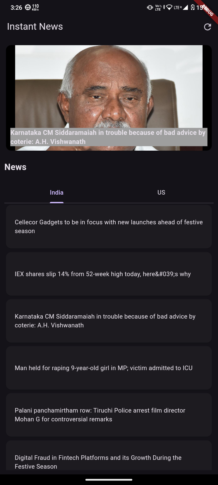

# News App

A simple Flutter news app that fetches real-time news from India and the US using
the [MediaStack News API](https://mediastack.com/). Users can provide their own API key in
the `lib/KEY.dart` file to fetch the latest news articles.

## Table of Contents

- [Overview](#overview)
- [Features](#features)
- [Installation](#installation)
- [Usage](#usage)
- [API Key Setup](#api-key-setup)
- [Screenshots](#screenshots)
- [Contributing](#contributing)
- [License](#license)

## Overview

This app fetches and displays news articles from India and the United States. Users can view top
headlines and explore different news categories. The app uses the MediaStack API to gather real-time
news data.

## Features

- Fetches top news from India and the US simultaneously.
- Simple and intuitive user interface.
- API key configuration via `lib/KEY.dart`.
- Cross-platform compatibility (iOS and Android).
- Responsive design for a smooth user experience.

## Installation

1. Clone the repository:
    ```bash
    git clone https://github.com/sanket92011/news_app.git
    ```
2. Navigate to the project directory:
    ```bash
    cd news_app
    ```
3. Install dependencies:
    ```bash
    flutter pub get
    ```

## Usage

1. Add your MediaStack API key to the `lib/KEY.dart` file.
2. Run the app:
    ```bash
    flutter run
    ```
3. Explore news articles from India and the US!

## API Key Setup

To use the MediaStack API, you need an API key:

1. Sign up at [MediaStack News API](https://mediastack.com/) and get your API key.
2. Open the `lib/KEY.dart` file and paste your API key:
    ```dart
    const  ACCESS_KEY = 'your_api_key_here';
    ```

## Screenshots

### India News Screen



### US News Screen


### Description News Screen


### Detailed WebView


## Contributing

Feel free to fork the repository and submit pull requests to improve the app or add new features.

## License

This project is licensed under the MIT License - see the [LICENSE](LICENSE) file for details.
